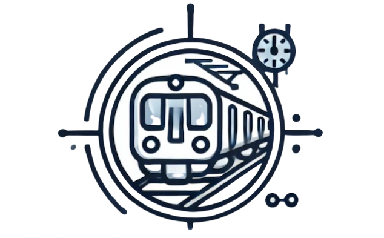
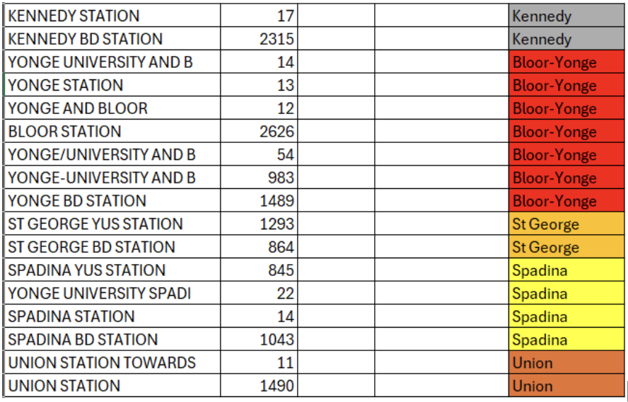
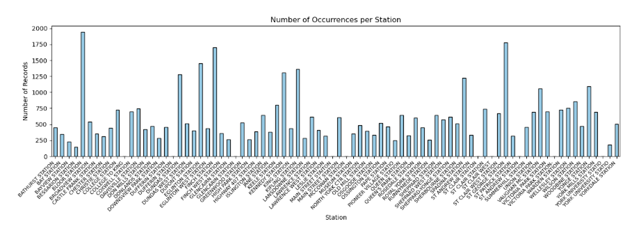

 

  

<h2  align="center">Event risk management</h2>

  

Risk management for event companies using machine learning

 

<a  href="https://event-risk-management.koyeb.app">View Demo</a>

·

<a  href="https://github.com/oleksiimorozenko/event-risk-management/issues">Report Bug</a>

·

<a  href="https://github.com/oleksiimorozenko/event-risk-management/issues">Request Feature</a>

  

## About the project

This repository contains a predictive model to estimate daily delay times at each station. This model will help event-planning companies optimize event dates and shuttle bus schedules by providing accurate delay forecasts. The goal is to enhance scheduling efficiency, minimize transportation disruptions, and improve attendee experience.
  

## Team members

  

This project was developed collaboratively by the following team members:

- Oleksii Morozenko  

- Colin (Lin) Song  

  

- Ian Lilley  

  

- Urooj Iftikhar  

- Mara Di Loreto  

- Brijesh Trivedi  

[ Video presentations](https://drive.google.com/drive/folders/1wjNnm4UX0zm2vnmKUTywFbkwBDyECnkx?usp=sharing).

## Table of Contents

[TOC]

## Project Overview

We analyzed TTC Subway Delay Data from open.toronto.ca, covering 2022, 2023, and 2024 across 259 subway stations and non-station transit facilities. The dataset includes 69,312 data points, each representing a daily subway delay. It logs key details such as the date, day of the week, time, station, train direction, train number, subway line, delay duration, and the time gap until the next train. Delay reasons are coded, with explanations provided in a separate document.

This project focused on applying data cleaning and processing techniques learned throughout the DSI course. The goal was to develop a solution that effectively utilizes the dataset to improve understanding of subway service interruptions in Toronto.

## Business Context
### Problem
The TTC subway system frequently experiences delays due to mechanical failures, signal issues, weather, passenger-related issues, and operator shortages, among other factors. These delays could make travel times unpredictable, affecting thousands of commuters daily.

### Impact
Event-goers rely on the TTC, but delays lead to late arrivals, missed experiences, and travel stress. Shuttle buses help, but often face congestion and high demand. For the event and hospitality industry, unreliable transit affects customer satisfaction, venue operations, and logistics. A predictive model can help planners anticipate disruptions, optimize scheduling, and improve transportation coordination.

### Stakeholders
Various sectors can benefit from this model, including:
* City governments & urban planning departments
* Transit agencies & public transportation authorities
* Event & hospitality industry
* Commuters & public transit applications
* Media & news organizations
* Logistics, ride-sharing, & mobility services
* Academic & research institutions
**Focus Area:** We have chosen to prioritize the **event and hospitality industry**.

### Solution: A Transit Delay Predictor

Our model provides event-planning companies with accurate transit delay forecasts, helping to optimize scheduling, coordinate shuttle services, and improve attendee experience. 

### User Needs

* Accurate Delay Predictions: Insights to plan around transit disruptions.
* Optimized Event Scheduling: Selecting dates with minimal transit congestion.
* Efficient Shuttle Coordination: Reducing wait times and improving logistics.
* Enhanced Attendee Experience: Ensuring smooth, stress-free transportation.
* Risk Mitigation: Proactively addressing potential transit issues.

### Business Goals

* Operational Efficiency: Streamlined logistics and reduced costs.
* Higher Attendee Satisfaction: Reliable transit improves events experience.
* Data-driven planning: Informed decision-making with predictive insights.
* Competitive Advantage: Better event execution through transit analytics.
* Sustainability & Accessibility: Reduced emissions and improved accessibility.

By aligning with event industry needs, our model helps ensure smooth, efficient, and well-coordinated events.

## Exploratory Analysis and Data Cleaning

Our initial hypothesis was that subway delays could be predicted using the available datasets. We proposed that by categorizing delay causes into two main groups, internal and external factors, we could focus on predicting delays based on internal factors, as these are the ones that can be improved directly. To enhance data processing, we further subdivided the internal factors into five categories.

We hypothesized that minute delays vary across different categories of categorical variables in the dataset, including season, day, time period, station, and bound. This suggests that these factors may influence minute delays, potentially contributing to variations in delay patterns observed in the data. **By analyzing these relationships through statistical testing, we aimed to determine whether specific categories significantly impact delay times.**

To ensure accuracy and minimize bias, we addressed several data challenges through specific validation and cleaning steps:

1. **Challenges Identified:**
    * Lack of documentation.
    * Inconsistencies in naming conventions.
    * Missing values in key columns.
2. **Reasons for Not Excluding Missing Values:**
    * No way to determine if data was intentionally omitted or simply unavailable.
    * Filling in missing data without understanding its cause could distort the analysis and lead to inaccurate predictions.

### Findings

When filtering station names, we found many spelling mistakes and instances where multiple names were used to refer to the same physical station. To standardize the data, we manually reviewed and corrected inconsistencies.

Spelling mistakes were quite common in this dataset. Examples include:

* CTR = CENTRE = CENTER
* MC COWAN = MCCOWAN
* ST GEORGE = ST. GEORGE

Additionally, multiple names were often used for the same station, particularly at transfer points between subway lines. For example, St George BD and St George YUS refer to the Bloor-Danforth and Yonge-University lines, respectively, but both represent the same physical station.

A day before the project presentation, we received updates from the TTC Business Intelligence and Analytics Department, clarifying that:

* Subway locations in the dataset indicate either where an event occurred or where it was reported. Some locations are outside subway stations, such as maintenance depots (carhouses), train yards, hostler handover points, and emergency exits.
* Directional data is included when an event affects a train, specifying the train's direction at the time of reporting. For example, a disorderly passenger on a northbound train at Eglinton Station would be recorded as Location: Eglinton, Direction: N (northbound).

After receiving updates from the TTC Open Data department, our approach to merging station names was deemed unsuitable and not adopted.

The total number of delay events per station is shown below:

When spelling mistakes and multiple names were standardized and combined, it had a significant impact on the top five most delayed stations.

<table>
  <tr>
   <td>
    <strong>Before cleaning</strong>
   </td>
   <td>
<strong>After cleaning</strong>
   </td>
  </tr>
  <tr>
   <td>
<ol>

<li>KIPLING STATION</li>

<li>KENNEDY BD STATION   </li>

<li>BLOOR STATION  </li>

<li>FINCH STATION</li>

<li>EGLINTON STATION </li>
</ol>
   </td>
   <td>
<ol>

<li>BLOOR STATION       </li>

<li>ST GEORGE STATION    </li>

<li>FINCH STATION     </li>

<li>EGLINTON STATION </li>

<li>KIPLING STATION</li>
</ol>
   </td>
  </tr>
</table>

## Data Processing

### Current data structure

**Date**, **Time**, **Day**, **Station**, **Code** (delay reason), **Min Delay**, **Min Gap**, **Bound**, **Line**, **Vehicle**

### Suggested features to add
 * Time of day categories (**Morning**/**Afternoon**/**Evening**/**Night**)

* **Season** (can be derived from date)

* Historical delay averages for each station

* Rolling averages for different time windows

* Special event flags (holidays, major events)

### Data preprocessing steps

* Handle missing values (currently about 34% of **Bound** data has missing values)

* Remove outliers (current data shows delays ranging from 2 to 716 minutes)

* Normalize numerical features

* Encode categorical variables (currently using OneHotEncoder)

* Create time-based features

* Group delays by station and time periods

### Selected Features {#selected-features}

* Original features: **Date**, **Time**, **Station**, **Code**, **Min Delay**, **Min Gap**, **Bound**, **Line**, **Vehicle**
* New time features: **Hour**, **Time_Period**
* Day features: **Day_Of_Week**, **Is_Weekend**
* Seasonal features: **Month**, **Season**
* Station statistics: **Station_Avg_Delay**, **Station_Std_Delay**
* Categorizations: **Delay_Category**, **Code_Category**
* Encoded versions of categorical features

## Model development

### First try

Initially, we tried to remove all zero-delay events, as well as the observations with missing bound values. It resulted in a significant shortening of the dataset: we ended up with about 5K observations out of 70K we had in the combined dataset. This data-cleaning approach is problematic as it eliminates 93% of the original observations, severely compromising the dataset's statistical significance and introducing selection bias by focusing only on five stations and non-zero delays. This aggressive filtering removes valuable baseline data about normal operations and system-wide patterns, while also discarding potentially informative missing values that could indicate specific types of delays or system states. Consequently, any model trained on this reduced dataset would have limited predictive capabilities and would be unable to provide insights about the entire transit system's behaviour.

### Second try

After removing Null values and keeping only the top 5 stations with the most delays, 7,744 observations remained. The goal was to predict whether there would be a TTC delay (binary classification) using the following models:

* Logistic Regression
* Binary Tree Classification
* Random Forest Classification
* Gradient Boosting Classification
* Neural Network Classification

### Third try (final)

This approach uses a dual model approach:

* Regression model - Random Forest Regression, to predict exact delay times \
	(actual delay minutes)
* Classification model - Random Forest Classification, to predict risk categories \
	(minor/moderate/major)
* Combined risk score: combines both model predictions

#### Methodologies

Since this approach combines two models; Random Forest Regression and Random Forest Classification, it enables the use of the full dataset (70,000 observations compared to approximately 5,000 after removing zero values in the first approach). By imputing missing values, it preserves more data, leading to more precise predictions, as zero delays indicate periods when the service was running smoothly.

Building on ideas from previous approaches, this method appears more effective: it leverages the full dataset (unlike approach 1) while also predicting exact delay times (unlike approach 2, which only provides a binary decision).

## Conclusion

Our attempt to predict delays on the TTC network provided valuable insights, demonstrating the potential of transit data for forecasting. A significant challenge was the time required to analyze and understand the dataset, as it contained inconsistencies and lacked key features. Despite this, we explored three different approaches before successfully designing a working predictive model. While our solution is functional, it remains a basic implementation with no UX/UI considerations. If needed, we are open to improving this aspect to enhance usability. This project strengthened our problem-solving skills, deepened our understanding of predictive modelling, and reinforced the importance of efficient data processing.

## Recommendations for TTC

We propose two key recommendations:

1. Enhancing TTC data collection practices.
2. Adding additional data variables and parameters.

### Enhancing TTC Data Collection Practices

#### Standardizing Data Naming Conventions
 - Use a Consistent Format: Adopt uniform naming conventions for all fields and categories to prevent inconsistencies (e.g., "Union" instead of "Union St." or "Union Station." or "Saint Andrew" instead of  "St. Andrew"). 
#### Handling Missing Data
 - Define Missing Data Indicators: Ensure missing values are represented consistently (e.g., NULL instead of “0” if the missing value means 0 minutes, or NR (not recorded) instead of NULL if the missing value hasn’t been recorded).
 - Apply Automated Data Validation: Use validation rules to detect and flag missing values early in the data pipeline. We don't know how this data is collected, whether manually or automatically, with a system; the official website does not provide this information. If parts of this process are digitized and automated, we recommend the following:
 - A validation script checks required fields (e.g., station names, bound) and flags entries where these fields are empty or contain invalid values.
 - An automated check identifies and marks duplicate records for review to prevent redundant data.
 - Add a ‘Notes’ Column: Store additional explanations for missing values to improve data interpretability.
#### Best Practices for Implementation
 - Upgrade the README.xlsx: Maintain a clear and accessible documentation framework for naming conventions, missing data handling, and validation rules. Avoid acronyms that are not explained. For example, TTC subway line abbreviations such as YU (Yonge-University), BD (Bloor-Danforth), SHP (Sheppard), and SRT (Scarborough Rapid Transit) should be explicitly defined to prevent confusion.
 - Regularly Audit Data: Perform periodic checks to identify and correct emerging inconsistencies.
 - Improve the Communication Channel: Establish a more responsive system, such as a dedicated contact for data issues or a public forum, to help users resolve gaps faster and improve efficiency and collaboration. 

#### Adding additional data variables and parameters

By providing the machine learning model with additional features that go beyond the basic incident type and location, we could significantly improve its predictive capabilities. 

Below is a list of recommended columns to add to the .xlsx files.

* Hour of Day
* Day of Week
* Day of Weekend
* Month
* Station ID
* Recent Incident at Station (Yes/No)
* Severity of Most Recent Incident (use three options)
* Type of Most Recent Incident at Station (incident code ID)
* Number of Incidents at Station (Last 24 Hours)
* Incident Code ID
* Line ID
